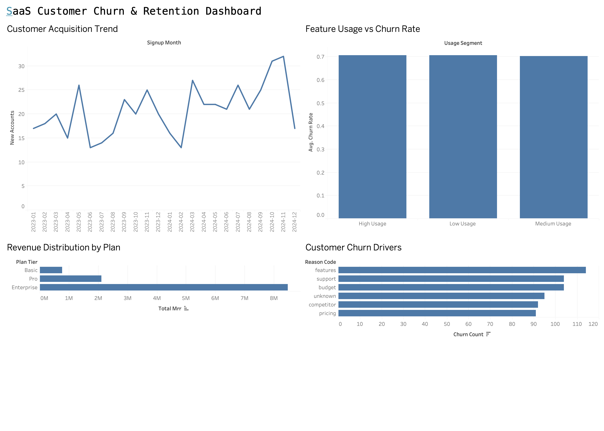
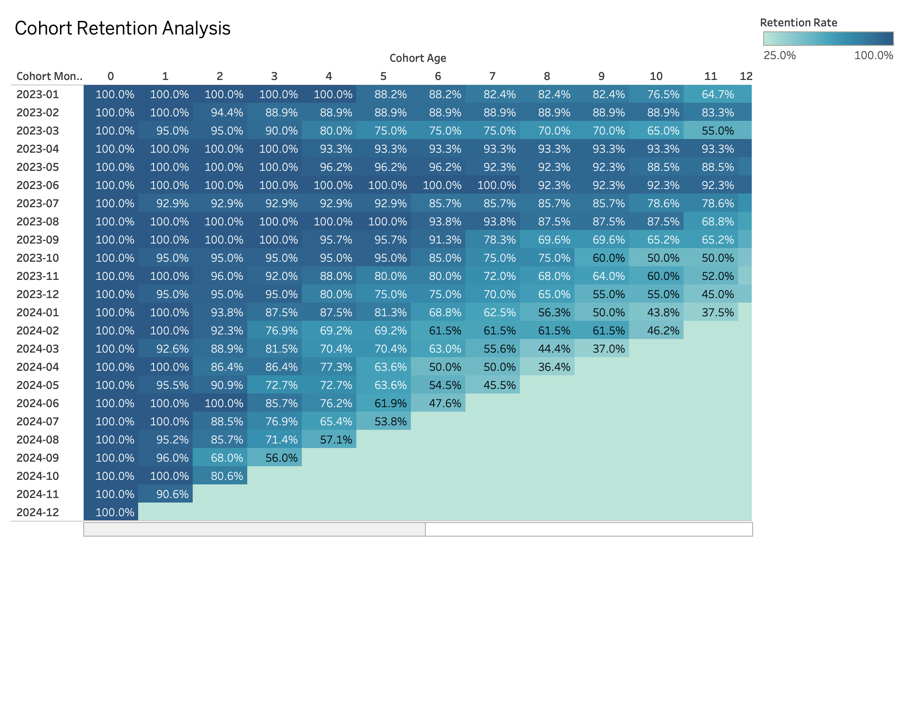

# SaaS Customer Churn & Retention Analysis | SQL + Tableau

SQL • Data Analytics • Tableau • Product Analytics

An end-to-end data analytics project analyzing customer acquisition, revenue distribution, churn drivers, and retention behavior for a simulated SaaS product.

This project demonstrates how structured product and subscription data can be transformed into business insights using SQL-based KPI modeling and interactive Tableau dashboards.

---

## Dashboard Preview



---

## Cohort Retention Analysis



---

## Project Snapshot

Dataset: SaaS product subscription dataset  
Rows analyzed: ~5000 subscription records  
Database: SQLite  
Queries written: 5 analytical SQL queries  
Visualization: Tableau dashboard  

---

## Project Overview

This project analyzes customer behavior in a SaaS environment to understand acquisition trends, revenue distribution, and customer churn patterns.

The workflow mirrors a typical analytics pipeline used in data-driven organizations:

1. Extract structured customer and subscription data  
2. Transform and aggregate metrics using SQL  
3. Design SaaS performance KPIs  
4. Visualize insights using Tableau dashboards  

The objective is to identify churn drivers and understand how customer retention evolves over time.

---

## Key Business Questions

This analysis explores several business-focused questions:

- How is customer acquisition trending over time?
- Which subscription plans generate the most revenue?
- What are the primary drivers of customer churn?
- Does feature usage influence customer churn behavior?
- How does customer retention change across cohorts?

---

## Dataset

The dataset simulates operational data from a SaaS platform.

Key tables used:

- accounts  
- subscriptions  
- churn_events  
- feature_usage  

These tables represent typical product analytics data sources used in SaaS companies.

---

## Tools Used

### SQL (SQLite)

Used for data transformation and metric modeling.

Key SQL techniques applied:

- JOIN operations across relational tables  
- GROUP BY aggregations  
- Conditional segmentation  
- KPI metric calculations  
- Data aggregation for dashboard inputs  

### Tableau

Used to build dashboards visualizing acquisition, revenue distribution, churn drivers, and retention trends.

### DB Browser for SQLite

Used for query development and database management.

---

## Key SaaS Metrics

The project models several analytical metrics commonly used in product analytics.

### Customer Acquisition

Monthly new customer signups used to evaluate growth trends.

### Monthly Recurring Revenue (MRR)

Total recurring revenue generated by subscription plans.

### Churn Drivers

Categorization of customer churn reasons.

### Feature Usage Segmentation

Customer segmentation based on product usage intensity.

### Cohort Retention

Customer retention analysis based on signup cohorts.

---

## SQL Analysis Pipeline

The SQL scripts follow a structured analytics workflow:

1. Monthly customer acquisition trends  
2. Revenue distribution by subscription plan  
3. Customer churn drivers  
4. Feature usage segmentation  
5. Cohort retention analysis  

These queries produce aggregated datasets used for dashboard visualization.

---

## Example Insights

### Revenue Concentration

Enterprise subscriptions generate the majority of revenue, indicating reliance on higher-tier customers.

### Churn Drivers

Product feature limitations and support issues are among the most common churn reasons.

### Retention Behavior

Retention gradually declines as cohort age increases, with noticeable drops after several months.

### Feature Usage Impact

Feature usage segmentation shows similar churn rates across usage tiers (~70%), suggesting that usage intensity alone may not fully explain churn behavior.

---

## Project Structure

```
saas-churn-analysis
│
├ dashboard
│   ├ saas_churn_dashboard.png
│   └ cohort_retention_heatmap.png
│
├ data
│   ├ signup_growth.csv
│   ├ churn_reasons.csv
│   ├ cohort_retention.csv
│   ├ feature_usage_segment.csv
│   └ mrr_by_plan.csv
│
├ sql
│   └ churn_analysis.sql
│
└ README.md
```

---

## Project Goal

This project demonstrates how product analytics can be used to transform raw SaaS operational data into business insights.

The analysis combines SQL data transformation with Tableau visualization to produce an interpretable SaaS analytics dashboard.

---

# Author

Sophia Choi  
Business Technology Management  

Data Analytics • SQL • Tableau • Business Operations Strategy
